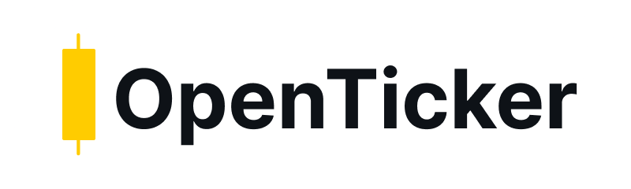
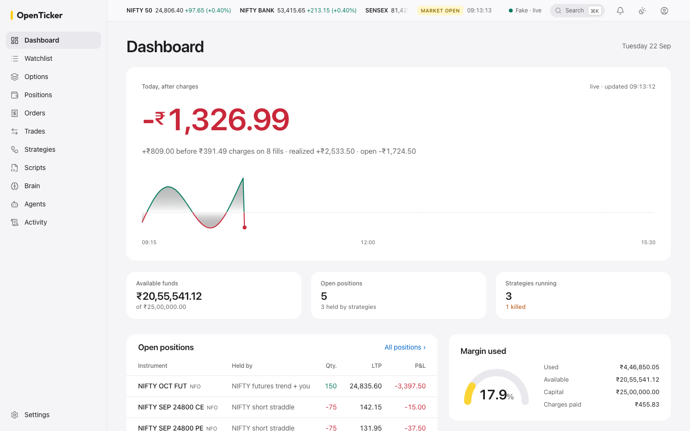
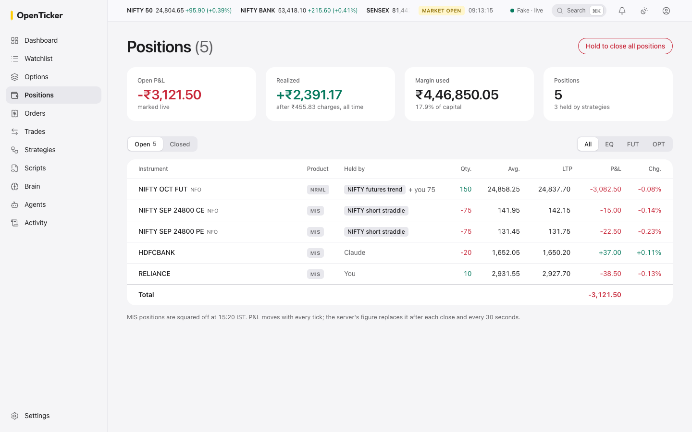
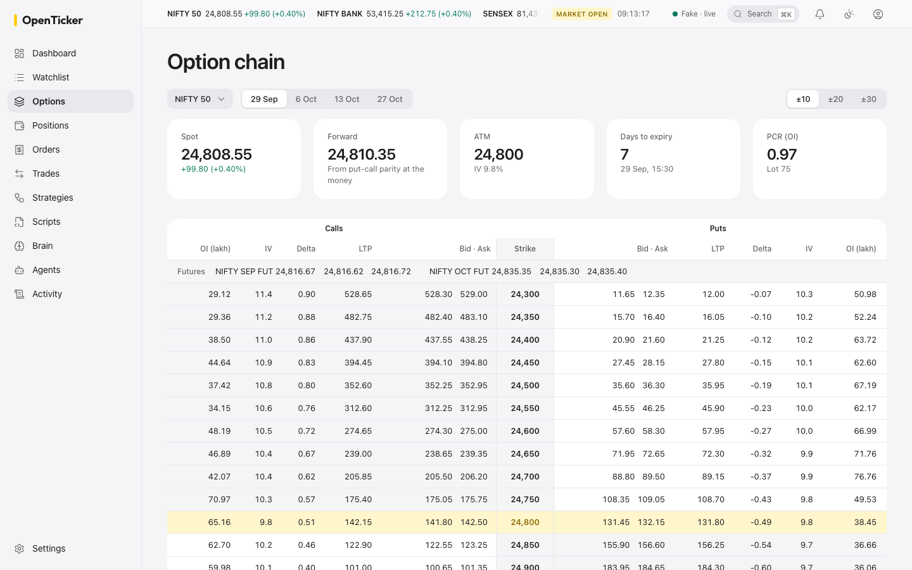
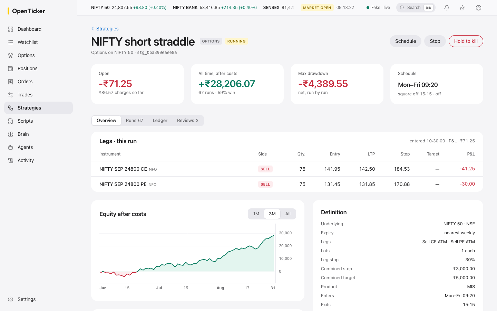
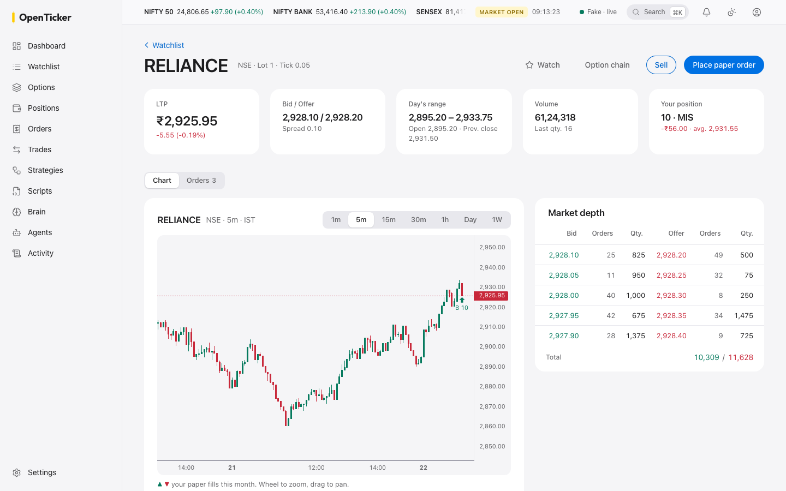
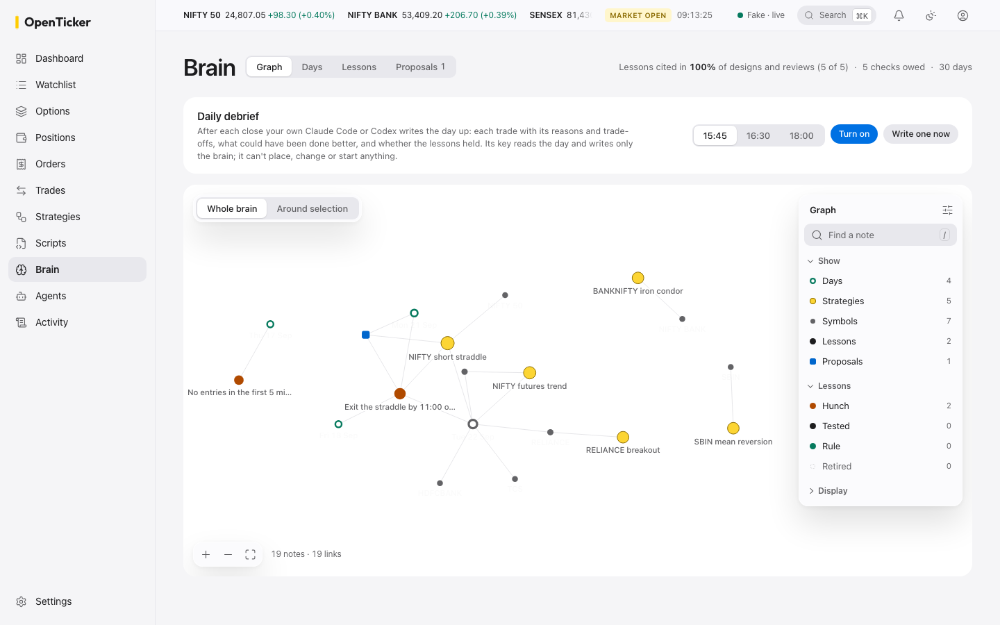
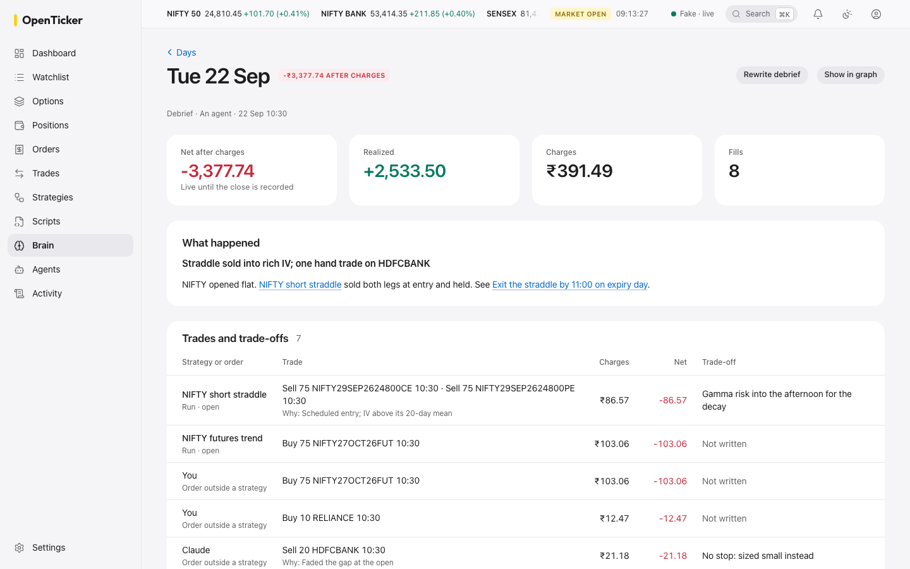

<h1></h1>

**A self-hosted trading platform for Indian markets that AI agents operate directly.**

OpenTicker exposes brokerage operations as [MCP](https://modelcontextprotocol.io) tools. Claude Code, Codex, or any MCP client can connect your broker, find instruments, and pull live quotes and historical candles by calling tools. A web app on the same server shows you everything they do as it happens, and lets you step in. It runs on your machine, with your own broker API keys, and stores everything locally.

> **Status: early development.** Market data works end to end with Zerodha. Orders are paper trades in a local sandbox; nothing is sent to the broker. See [Roadmap](#roadmap).



## What an agent can do today

| Tool | What it does |
| --- | --- |
| `get_broker_login_url` | Start a broker login. You log in on the broker's own page. |
| `connect_broker` | Finish the login; the session is stored encrypted and never returned. |
| `sync_instruments` | Download the broker's instrument list (~80,000 contracts) into a local database. |
| `search_instruments` | Find symbols: `RELIANCE`, `NIFTY 50`, all `NIFTY22SEP26` options, ... |
| `get_quote` | Live last traded price. |
| `get_historical_bars` | OHLCV candles (minute to daily), also stored locally in DuckDB. |
| `get_option_chain` | Calls and puts around at-the-money for an index or stock: price, open interest, implied volatility, Greeks. |
| `place_order` | Paper trade in the local sandbox while the exchange is open: MARKET fills at the live price; LIMIT, SL and SL-M orders wait and fill when the price reaches them. Nothing reaches the broker. |
| `cancel_order` | Withdraw a waiting order. |
| `get_market_status` | Whether NSE, BSE, NFO, BFO and MCX are open now, and the next session. Knows weekends, exchange holidays and special sessions. |
| `get_positions`, `get_funds`, `get_orderbook` | Sandbox positions with live P&L, virtual capital and margin, order history. |
| `evaluate_risk` | Check stop loss, target and capital cap settings against the live price before acting. |
| `get_audit_log` | What OpenTicker has done and who triggered it, most recent first. |
| `create_strategy`, `update_strategy`, `get_strategy`, `list_strategies`, `delete_strategy` | Save options strategies of up to 10 legs chosen relative to the market (ATM, N strikes in or out of the money, weekly or monthly expiry), with a schedule and strategy-wide limits. |
| `preview_strategy` | The real contracts a strategy would trade right now, with prices and net premium. Places nothing. |
| `start_strategy`, `stop_strategy`, `close_strategy_leg` | Enter a strategy in the sandbox; `openticker-serve` then watches it on live prices and closes legs on their own stops and targets, and the whole run on the strategy's limits, with nobody in the conversation. |
| `schedule_strategy`, `unschedule_strategy` | Enter a strategy automatically at its entry time on its weekdays, skipping market holidays. Its exit time and expiry-day exit close every run, scheduled or not. |
| `kill_strategy`, `release_kill_switch` | Lock a strategy and close everything it holds; unlock it. A locked signal strategy refuses its alerts. |
| `create_signal_strategy`, `update_signal_strategy` | Save a strategy that alerts drive: up to 10 contracts (stocks, futures or options) that alerts enter and exit long or short, one at a time, with per-leg stops and targets, an entry window, a direction filter and strategy-wide limits. |
| `rotate_strategy_webhook`, `disable_strategy_webhook` | Give a signal strategy an alert URL for TradingView or ChartInk, optionally limited to the senders' IP addresses; the old URL stops working. |
| `get_strategy_signals` | Every alert a signal strategy received, whether it was accepted, and what came of it. |
| `upload_script`, `update_script`, `delete_script`, `list_scripts`, `get_script` | Save your own Python strategy script. It trades through the REST API with a key made for each run that reaches only prices, orders and positions; it is never given your broker keys or other secrets. |
| `start_script`, `stop_script`, `schedule_script`, `unschedule_script`, `get_script_logs` | Run a script under `openticker-serve` now or once a trading day between a start and a stop time, with memory and CPU limits, and read its output. Linux and macOS. |
| `get_strategy_runs`, `get_strategy_run` | A strategy's runs: legs, fills, stop reason, P&L (with its peak and trough) and a timeline of what happened. If the live feed goes quiet on a leg, `openticker-serve` prices it from quotes; with no price from either for a minute, the run stops and closes its legs. After a restart it picks up every open run where it left off. |

| `search_brain`, `get_brain_note`, `get_brain_graph` | Read the brain: what the desk learned from its own trades, as linked notes of days, lessons and proposals, each lesson with its status and how often it held. |
| `get_day_record`, `write_debrief` | One trading day's trades from the record, with the lessons owed a check; write the day's debrief: why each trade, what was given up, what could have been done better. |
| `create_lesson`, `update_lesson`, `check_lesson`, `record_lesson_use` | A lesson starts as a hunch; checks on later runs and orders decide whether it becomes tested, a rule, or is retired. |
| `raise_proposal`, `decide_proposal` | Propose one change to a strategy for you to accept or reject; accepting gives you the request to paste into your agent. |
| `start_debrief`, `schedule_debrief`, `get_learning` | Have `openticker-serve` debrief each day after the close with your own agent, and see how often designs and reviews read a lesson first. |

Example session, in plain language to your agent:

> "Connect Zerodha, then show me the last month of daily candles for RELIANCE and this week's NIFTY option chain with IV and delta."

## Quickstart

Requires Python 3.13+, [uv](https://docs.astral.sh/uv/), and a [Zerodha Kite Connect](https://developers.kite.trade/) app.

```bash
git clone https://github.com/kushalBanda/openticker.git
cd openticker
uv sync
cp .env.example .env    # add KITE_API_KEY and KITE_API_SECRET
```

Setting up the Kite app, step by step: [docs/setup/zerodha.md](docs/setup/zerodha.md).

### Add it to your agent

**Claude Code**

```bash
claude mcp add openticker -- uv --directory /absolute/path/to/openticker run openticker-mcp
```

**Any MCP client** (JSON config)

```json
{
  "mcpServers": {
    "openticker": {
      "command": "uv",
      "args": ["--directory", "/absolute/path/to/openticker", "run", "openticker-mcp"]
    }
  }
}
```

Then ask the agent to connect Zerodha. It walks you through login and instrument sync.

### The web app

`openticker-serve` also serves a web app at `http://127.0.0.1:8750`. Build it once (needs [Node 22](https://nodejs.org) and [pnpm](https://pnpm.io)), then start the server:

```bash
cd ui && pnpm install && pnpm build && cd ..
uv run openticker-serve
```

It prints a sign-in link and opens it in your browser; `uv run openticker-serve ui login` prints another. The link works once, for 10 minutes, and signs that browser in for 30 days. The server listens on this machine only.

The first thing you see is today: your P&L after charges, the shape of the day so far, and what changed since you last looked. Below it everything is live: positions and P&L as they tick, every order and fill with what it cost, and each strategy and script with what it's doing and what it's made after charges. Every line says who did it: you, Claude, Codex, a strategy, a TradingView alert or one of your scripts. When something needs you, a killed strategy or an expired Zerodha session, it's at the top of the page with the button that fixes it.

You can step in without asking your agent: close a position, kill a strategy, place a paper order from any page with ⌘K, or build an iron fly from the option chain and see its payoff and margin before you place it. Creating and changing strategies and scripts stays with your agent; the app gives you the prompt to ask it with.

| | |
| --- | --- |
|  |  |
|  |  |
|  |  |

The Brain page is what the desk has learned, kept on your machine and readable by any agent. After each close your own Claude Code or Codex can write the day up: why each trade was made, what was given up for it, and what could have been done better, with hindsight marked as hindsight. Lessons start as hunches and earn their status from later trades, so one bad day stays a hunch. Agents read them before designing or reviewing a strategy, and propose changes that wait for you to decide.

Light and dark follow your system, or the toggle in the top bar. The app is for laptop and desktop screens, 1280 pixels wide and up.

### Research with your agent: `labs/`

The repository ships a `labs/` folder set up for Claude Code and Codex: the OpenTicker server already configured, shared instructions, and skills such as `new-strategy`, which turns an idea in plain words into a paper strategy previewed against today's market.

```bash
uv run openticker-serve   # in its own terminal: watches strategies once they run
cd labs
claude                    # or: codex
```

Then describe an idea. Your notes go in `labs/notes/`, which is never committed. Once a strategy has run at least 10 times, ask the agent to review it: the `reviewer` judges its runs after costs against what your note said would prove it wrong, and writes a dated verdict (keep, change one thing, or retire) into the note. It can't change anything else. `openticker-serve` can also run that review unattended, when you ask (`start_review`) or on a schedule you set per strategy (`schedule_review`: every so often, after so many runs, or when it falls a set amount below its high), with your own Claude Code or Codex, signed in as you. A scheduled review waits for a new run to have ended, so an idle strategy costs nothing. The job reaches OpenTicker over MCP at `/mcp` on the server, with a key that reads only that strategy. See [labs/playbook](labs/playbook/README.md).

### REST API (optional)

Everything the tools do is also available over HTTP, for scripts and tools that aren't MCP clients:

```bash
uv run openticker-serve keys create laptop    # prints a key, once
uv run openticker-serve                       # http://127.0.0.1:8750, docs at /docs
curl -H "X-API-Key: otk_..." "http://127.0.0.1:8750/api/v1/quote?broker=zerodha&symbol=RELIANCE&exchange=NSE"
```

Every route except `/health` and signal strategies' alert URLs needs a key. An alert URL (`/webhooks/strategies/<token>`) carries its own token, which is shown once by `rotate_strategy_webhook`; to receive alerts from TradingView or ChartInk, put `openticker-serve` behind a tunnel or reverse proxy and set `OPENTICKER_PUBLIC_URL` to its address. `keys list` and `keys revoke <name>` manage them. The server listens on this machine only unless `OPENTICKER_BIND` says otherwise.

The server also streams live prices from the broker (Kite's WebSocket ticker) for every open sandbox position, every waiting order and anything listed in `OPENTICKER_WATCH`. It fills waiting LIMIT/SL/SL-M orders as prices cross them, closes intraday (MIS) positions 15 minutes before the session ends, and settles expired futures and options at the underlying's closing price on expiry day. If the broker session expires, it notifies you to log in again.

It also runs your uploaded Python scripts. Each gets `OPENTICKER_URL` and `OPENTICKER_API_KEY` in an environment that holds nothing else of yours, and calls the API like any client:

```python
import os, httpx

api = httpx.Client(base_url=os.environ["OPENTICKER_URL"],
                   headers={"X-API-Key": os.environ["OPENTICKER_API_KEY"]})
api.post("/api/v1/orders", json={"broker": "zerodha", "symbol": "SBIN", "exchange": "NSE",
                                 "side": "BUY", "quantity": 10, "product": "MIS"})
```

Scripts are your own trusted code: they run as your user and could read your files. The clean environment keeps secrets from reaching them by accident; it is not a sandbox for code from strangers (ADR 25).

### Notifications (optional)

Orders and risk breaches can be sent to Slack (Incoming Webhook) and/or email (any SMTP server, including Resend and Amazon SES). Set the variables in `.env`; see `.env.example`. Everything is recorded in the local audit log either way.

## How it works

```
 MCP client (agent)                  HTTP client · browser (ui/)
      │  tool calls over stdio          │  X-API-Key or session cookie; live prices over one WebSocket
      ▼                                 ▼
 adapters/inbound/mcp_server.py      adapters/inbound/rest_api.py, web/ (openticker-serve)
      │                                 │
      └──────────────┬──────────────────┘
      ▼
 use_cases/                          one function per operation
      │                 │
      ▼                 ▼
 ports/ (Protocols) ◄── adapters/brokers/zerodha    Kite Connect: auth, instruments, market data
      │
 events/   bus: audit log (inline) · notifications to Slack/email (background)
 storage/  SQLite (credentials, instruments, audit log) · DuckDB (historical bars)
```

Hexagonal architecture: domain logic depends only on interfaces, so adding a broker or another entry point (REST, webhooks) doesn't touch the core. Every significant design decision is written up in [docs/adr/](docs/adr/).

Data lives in `~/.openticker` (override with `OPENTICKER_HOME`). Broker session tokens are encrypted at rest with a locally generated key.

## Roadmap

- More brokers, added on demand

## Contributing

Contributions are welcome. Start with [CONTRIBUTING.md](CONTRIBUTING.md); new brokers are a great first area. Please follow the [Code of Conduct](CODE_OF_CONDUCT.md), and report security issues privately as described in [SECURITY.md](SECURITY.md).

## Disclaimer

OpenTicker is not investment advice and is provided without warranty (see [LICENSE](LICENSE)). Trading involves risk of loss. You are responsible for every action taken with your broker account, including actions taken by an AI agent you connect to it.

OpenTicker is an independent project, not affiliated with or endorsed by Zerodha or any other broker. Your use of a broker's API is governed by that broker's terms.

## License

[Apache 2.0](LICENSE)
